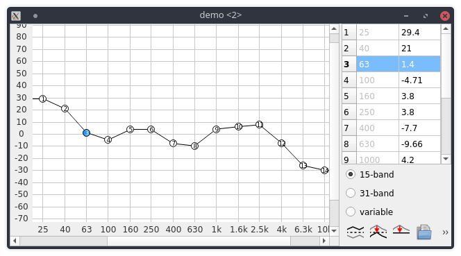

# GraphicEQWidget

This is a graphical equalizer widget for Qt. Most code chunks originated from [EqualizerAPO](https://sourceforge.net/projects/equalizerapo/) which is licensed under GPLv2. This widget has been extracted from their project and has been modified to run on any operating system, completely independent of any Win32 calls. Additionally, the layout has been designed to be much more compact and a method to parse Graphic-EQ data has been implemented.

*All credits go to the original EqualizerAPO developer*

### Usage

#### Include it in your project

Copy the `GraphicEQWidget` subdirectory from this repository into your project folder and add this to your qmake project file:

```cmake
include(GraphicEQWidget/GraphicEQWidget.pri)
```

#### Load points

```c++
GraphicEQFilterGUI* eq = new GraphicEQFilterGUI();
eq->load("GraphicEQ: 25 24.18; 40 34.28; 63 -10.78; 100 39.69; 160 23.66; 250 12.77; 400 3.19; 630 48.33; 1000 35.76; 1600 22.98; 2500 8.84; 4000 1.64; 6300 9.71; 10000 17.91; 16000 26.25");
eq->show();
```

#### Store points

```c++
QString points = "";
eq->store(points);
//'points' contains now the graphic-eq data
```

### Screenshot

